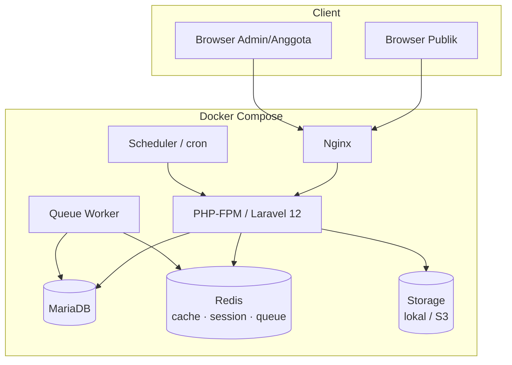

# 2. Perancangan Arsitektur Aplikasi

---

## 2.1 Gambaran Umum

Arsitektur mengikuti pola **modular monolith**: satu aplikasi Laravel dengan batas modul yang tegas per domain. Ini pilihan yang tepat untuk skala Orda — sederhana untuk dioperasikan (satu deployment), namun batas modul yang disiplin membuatnya siap dipecah menjadi service/API terpisah bila kelak dibutuhkan.



## 2.2 Lapisan Arsitektur

```
┌─────────────────────────────────────────────────────────┐
│ Presentation                                            │
│  Livewire 3 Components (Full-page & nested)             │
│  Blade + Flux UI + Alpine.js                            │
├─────────────────────────────────────────────────────────┤
│ Application                                             │
│  Service classes (use-case per domain)                  │
│  Form Requests / Livewire validation · Policies         │
│  Events → Listeners (async via Queue) · Jobs            │
├─────────────────────────────────────────────────────────┤
│ Domain                                                  │
│  Eloquent Models · Enums · Query Builders (scopes)      │
│  DTO (Data objects) untuk lintas-lapisan                │
├─────────────────────────────────────────────────────────┤
│ Infrastructure                                          │
│  MariaDB · Redis · Filesystem/S3 · Mail · Scout         │
│  Paket Spatie (Permission, MediaLibrary, ActivityLog)   │
└─────────────────────────────────────────────────────────┘
```

### Aturan lapisan

1. **Livewire component tidak berisi logika bisnis.** Component menerima input, memanggil Service, dan menampilkan hasil. Maksimum yang boleh ada di component: validasi input, otorisasi (`$this->authorize()`), dan state UI.
2. **Service adalah pintu masuk use-case.** Contoh: `MemberService::register()`, `PublishingService::submitForReview()`, `EventService::checkIn()`. Service boleh memanggil model, event, job, dan service lain.
3. **Repository pattern hanya bila perlu.** Eloquent sudah merupakan abstraksi data yang baik. Repository dibuat hanya untuk query kompleks yang dipakai berulang (mis. `ExpertSearchRepository` untuk pencarian pakar multi-kriteria) — bukan wrapper CRUD kosong.
4. **Side-effect berat lewat Event/Queue.** Kirim email, generate sertifikat, ekstraksi teks dokumen, resize gambar — semuanya asinkron.
5. **Otorisasi dua tingkat**: permission Spatie di level route/menu ("boleh masuk modul?"), Policy di level record ("boleh edit record *ini*?").

## 2.3 Struktur Modular per Domain

Setiap domain dikelompokkan dengan namespace konsisten (detail folder di dok. 05):

| Domain | Isi utama |
|--------|-----------|
| `Membership` | Anggota, kecamatan, profesi, status keanggotaan |
| `Expertise` | Taksonomi kepakaran, klaim & verifikasi, pencarian pakar |
| `Organization` | Periode, unit/divisi, jabatan, penugasan pengurus |
| `Publishing` | Post (berita/artikel/opini/press release), kategori, tag, workflow review, newsletter |
| `Archive` | Dokumen, kategori, versi, hak akses, full-text search |
| `Events` | Agenda, registrasi, kehadiran QR, laporan, sertifikat |
| `MediaCenter` | Aset brand & template |
| `Gallery` | Album foto & video |
| `Dashboard` | Agregasi statistik & widget |
| `Core` | User, peran, setting, halaman statis, menu, audit |

Komunikasi antar-domain melalui **Service publik** atau **Event** — model domain lain tidak di-query langsung dari Livewire component domain berbeda.

## 2.4 Alur Request

### Halaman publik (contoh: detail berita)
```
Route → Livewire full-page `Public\Posts\Show`
  → PostService::findPublished(slug)  [cache 10 menit]
  → render Blade + Flux → response
  → dispatch event PageViewed (queue) → catat statistik
```

### Aksi admin (contoh: approve artikel)
```
Livewire `Admin\Publishing\ReviewQueue::approve($postId)`
  → authorize('approve', $post)            [Policy]
  → PublishingService::approve($post, $user)
      → transisi status In Review → Published (state machine Enum)
      → event PostPublished
          → Listener: bersihkan cache halaman publik
          → Listener: notifikasi penulis (queue)
```

## 2.5 Keputusan Arsitektur Kunci (ADR ringkas)

| # | Keputusan | Alasan |
|---|-----------|--------|
| 1 | Modular monolith, bukan microservice | Tim kecil, satu deployment, kompleksitas operasional rendah; batas modul menjaga maintainability |
| 2 | Livewire full-page component sebagai "controller" | Konsisten satu paradigma; controller klasik hanya untuk endpoint non-UI (webhook, file streaming, QR check-in API) |
| 3 | Flux UI sebagai design system tunggal | Konsistensi visual; komponen custom dibuat mengikuti token Flux |
| 4 | Status workflow sebagai PHP Enum + guard transisi | Transisi ilegal (Draft → Published tanpa review) ditolak di satu tempat |
| 5 | Laravel Scout + database driver (awal) → Meilisearch (opsional) | Full-text search bisa jalan tanpa infra tambahan; upgrade path jelas |
| 6 | Spatie MediaLibrary untuk semua file | Satu pola untuk foto profil, poster, arsip, aset; conversions otomatis (thumbnail, WebP) |
| 7 | File privat via streamed response + Policy | URL arsip tidak bisa ditebak/dibagikan tanpa hak akses |
| 8 | Statistik dashboard di-cache Redis, dihitung ulang via scheduler | Dashboard cepat tanpa membebani DB pada setiap kunjungan |

## 2.6 Kesiapan Pengembangan Jangka Panjang (Extensibility)

| Kebutuhan masa depan | Persiapan arsitektur sekarang |
|----------------------|-------------------------------|
| REST API & Mobile App | Logika di Service layer (bukan di Livewire) → tinggal tambah `routes/api.php` + API Resource + Sanctum |
| SSO | Autentikasi terisolasi di modul Core; siap ditukar ke Socialite/OIDC |
| Integrasi WhatsApp/Email | Notifikasi memakai Laravel Notification channel — tambah channel baru tanpa ubah pemanggil |
| AI Assistant / ringkasan rapat / pencarian semantik | Konten arsip & publikasi tersimpan terstruktur + teks terekstrak; tinggal tambah pipeline embedding (job queue) dan tabel vektor |
| Rekomendasi narasumber | Direktori kepakaran sudah menstrukturkan data bidang/level/bukti — dasar fitur rekomendasi |
| Multi-Orda | Semua entitas berpusat pada satu Orda; penambahan `orda_id` + global scope memungkinkan multi-tenant |

## 2.7 Keamanan

- **Autentikasi**: Laravel Fortify/starter kit Livewire; verifikasi email wajib; 2FA TOTP untuk peran admin.
- **Otorisasi**: Spatie Permission (role/permission) + Policy per model; permission di-seed, tidak dibuat manual di UI produksi.
- **Berkas**: unggahan divalidasi MIME & ukuran; disimpan di disk `private` kecuali dipublikasikan; antivirus scan (ClamAV) opsional pada fase lanjut.
- **Header**: CSP dasar, X-Frame-Options, HSTS via Nginx.
- **Rate limiting**: login, form kontak, registrasi kegiatan.
- **Audit**: spatie/laravel-activitylog pada model sensitif (Member, Document, Post, User, penugasan pengurus).
