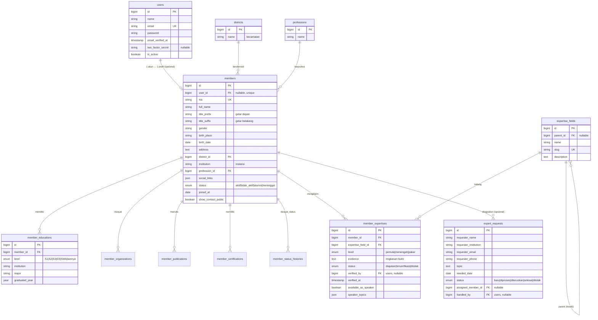
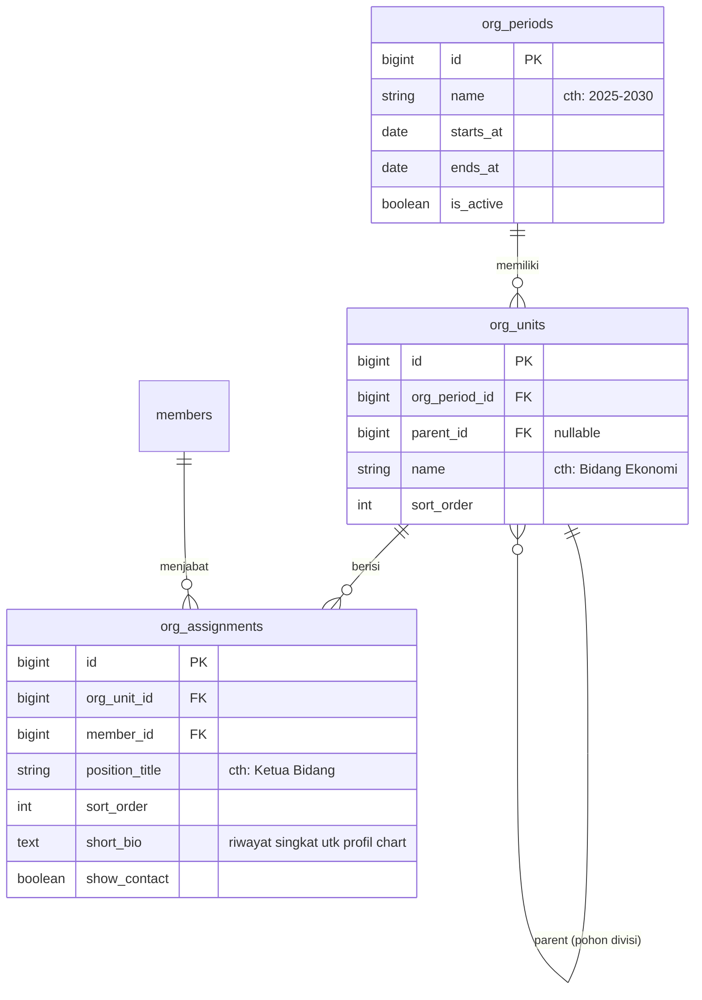
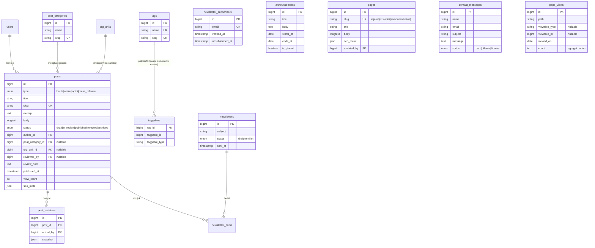
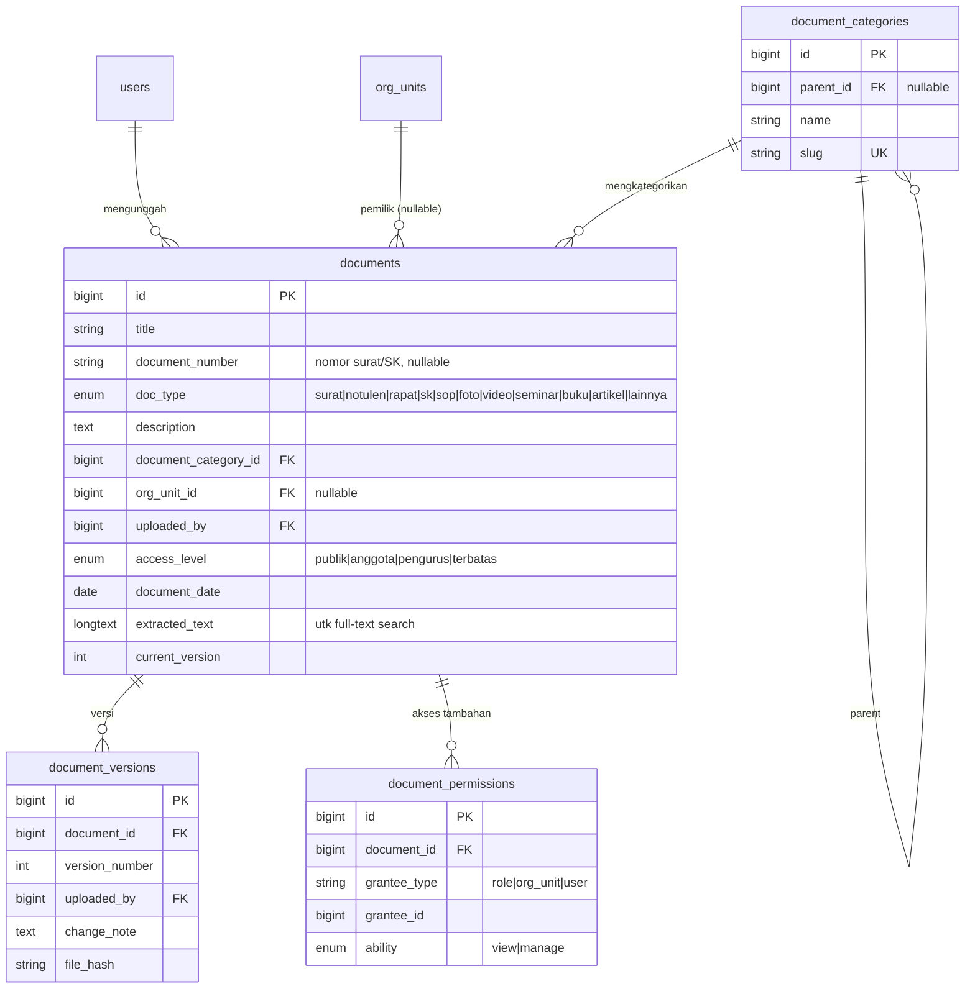
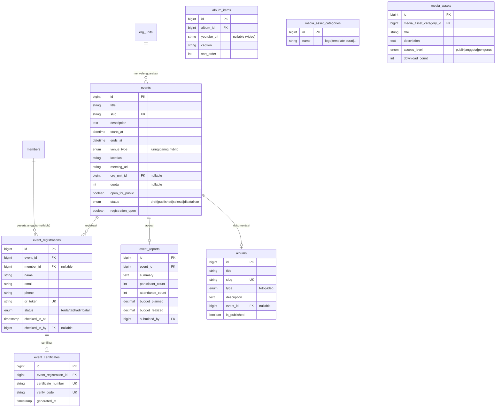

# 3. Desain Basis Data (ERD)

Konvensi: tabel `snake_case` jamak, PK `id` (bigint), FK `<tabel_tunggal>_id`, semua tabel memiliki `created_at`/`updated_at`, soft delete (`deleted_at`) pada entitas penting (members, documents, posts, events).

---

## 3.1 ERD — Keanggotaan & Kepakaran

Foto profil, dokumen sertifikasi, dan bukti kepakaran disimpan melalui **Spatie Media Library** (tabel `media`, relasi polimorfik) — tidak digambar ulang di setiap diagram.

## 3.2 ERD — Struktur Organisasi

Satu pohon `org_units` per periode → filter periode pada org chart cukup mengganti `org_period_id`. Duplikasi struktur ke periode baru disediakan sebagai aksi admin ("salin struktur periode").

## 3.3 ERD — Publikasi & Konten Publik

## 3.4 ERD — Arsip Digital

File fisik tiap versi disimpan di Media Library dengan collection `versions` pada model `DocumentVersion`; riwayat perubahan lain dicatat `activity_log`.

## 3.5 ERD — Kegiatan, Galeri, Media Center

## 3.6 Tabel Paket Pihak Ketiga

| Tabel | Sumber | Fungsi |
|-------|--------|--------|
| `roles`, `permissions`, `model_has_roles`, `model_has_permissions`, `role_has_permissions` | spatie/laravel-permission | RBAC |
| `media` | spatie/laravel-medialibrary | Semua file (foto, dokumen, poster, aset) |
| `activity_log` | spatie/laravel-activitylog | Audit trail |
| `jobs`, `failed_jobs`, `job_batches` | Laravel | Queue |
| `cache`, `sessions` | Laravel | Bila tidak memakai Redis |
| `notifications` | Laravel | Notifikasi database |

## 3.7 Indeks & Catatan Kinerja

- Indeks unik: `members.nia`, `posts.slug`, `events.slug`, `event_registrations.qr_token`, `event_certificates.verify_code`.
- Indeks komposit: `posts (type, status, published_at)`, `member_expertises (expertise_field_id, status)`, `page_views (path, viewed_on)` unik untuk agregasi harian.
- `FULLTEXT` index pada `documents (title, description, extracted_text)` dan `posts (title, body)` — dipakai Scout database driver; siap dipindah ke Meilisearch tanpa ubah skema.
- Statistik dashboard dibaca dari cache Redis, bukan agregasi langsung saat request.
