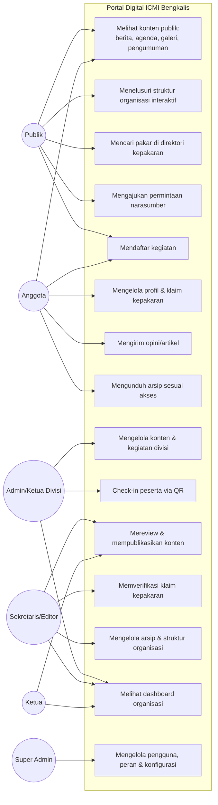
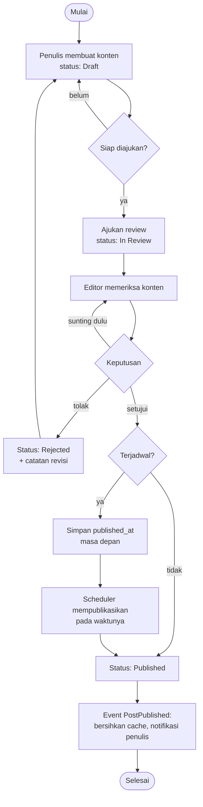
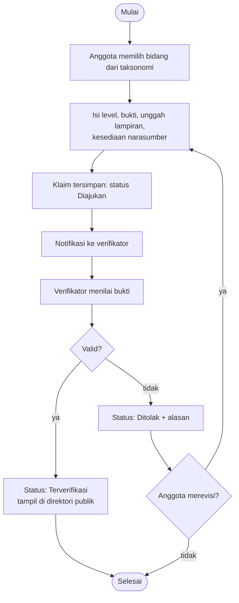
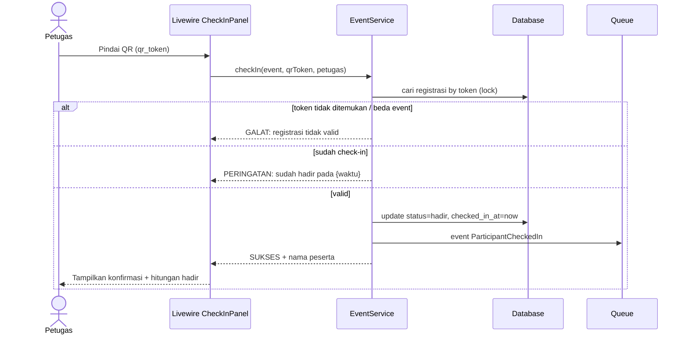
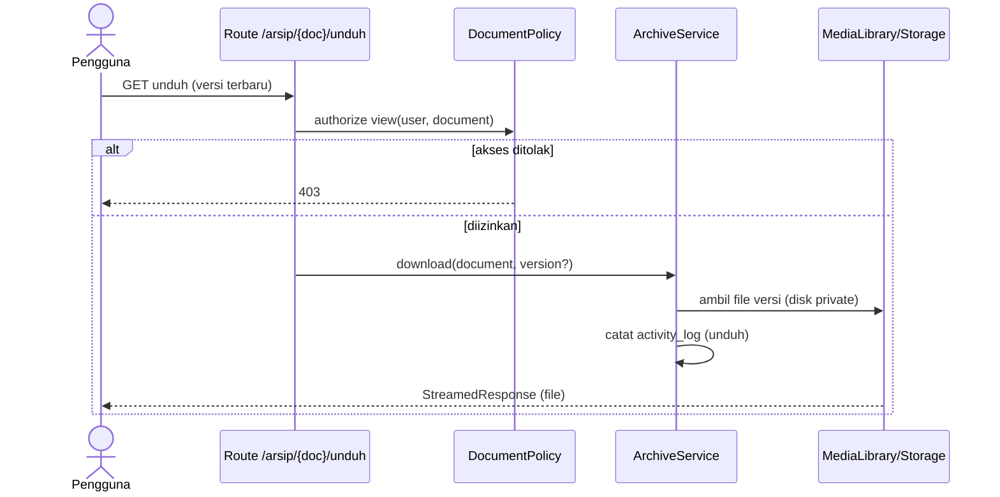
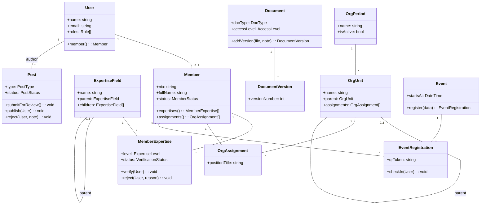
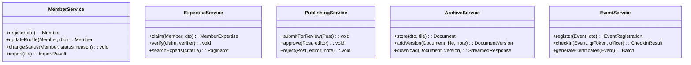

# 4. Diagram UML

Diagram dipilih untuk alur yang paling menentukan perilaku sistem. Semua dalam format Mermaid agar mudah diperbarui bersama kode.

---

## 4.1 Use Case Diagram (utama)

Catatan pewarisan aktor: Anggota mewarisi akses Publik; Admin Divisi mewarisi Anggota; Sekretaris/Ketua/Super Admin mewarisi Admin Divisi (lingkup penuh, bukan per divisi).

## 4.2 Activity Diagram — Workflow Publikasi (Draft → Review → Publish)

## 4.3 Activity Diagram — Verifikasi Kepakaran

## 4.4 Sequence Diagram — QR Check-in Kegiatan

## 4.5 Sequence Diagram — Unduh Arsip Terproteksi

## 4.6 Class Diagram — Domain Inti (disederhanakan)

### Service layer (kontrak utama)

