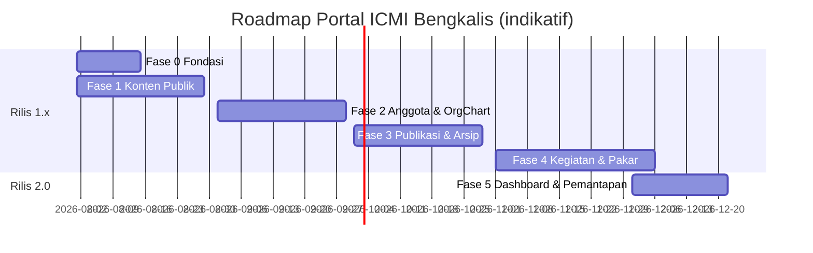

# 6. Roadmap Implementasi Bertahap

Estimasi mengasumsikan 1–2 developer. Setiap fase menghasilkan sistem yang **bisa dipakai** (increment), bukan setengah jadi. Durasi bersifat indikatif dan dapat disesuaikan kapasitas tim.

---

## Fase 0 — Fondasi (1–2 minggu)

**Sasaran**: kerangka proyek siap dikembangkan bersama.

- Setup Laravel 12 + Livewire 3 + Flux UI + Tailwind + Alpine.
- Docker Compose dev (app, nginx, mariadb, redis, mailpit) — dok. 09.
- Autentikasi (login, verifikasi email, reset password), layout dasar publik & admin, dark mode.
- Spatie Permission + `RolePermissionSeeder` (8 peran, permission inti).
- Spatie Media Library + konfigurasi disk `public`/`private`.
- CI (lint Pint + test), konvensi kode (dok. 10), seeder kecamatan.

**Kriteria selesai**: developer baru bisa `docker compose up` dan login sebagai tiap peran.

## Fase 1 — Identitas Digital & Konten Publik (3–4 minggu)

**Sasaran**: website resmi tayang (soft launch).

- Halaman statis terkelola: Tentang, Sejarah, Visi & Misi, Sambutan Ketua, Program Kerja.
- Publikasi dasar: Berita & Artikel + kategori + tag (admin langsung publish; workflow review menyusul Fase 3).
- Pengumuman, Agenda (tampilan publik, tanpa registrasi), Galeri foto/video, Kontak.
- Beranda, SEO (meta, OG, sitemap), penghitung kunjungan.
- **Rilis 1.0 — website publik.**

## Fase 2 — Keanggotaan & Struktur Organisasi (3–4 minggu)

**Sasaran**: database anggota jalan, org chart interaktif tayang.

- CRUD anggota lengkap + impor Excel + pencarian/filter (kecamatan, profesi, keahlian, pendidikan, status).
- Akun anggota: aktivasi, kelola profil sendiri.
- Master data: profesi, taksonomi bidang keahlian (dipakai lagi oleh Fase 4).
- Struktur organisasi: periode, unit/divisi, penugasan; org chart interaktif (zoom, expand/collapse, cari, filter periode, profil pengurus).
- **Rilis 1.1 — direktori anggota & struktur organisasi.**

## Fase 3 — Publikasi Berworkflow & Arsip Digital (3–4 minggu)

**Sasaran**: alur editorial dan arsip resmi organisasi.

- Workflow Draft → In Review → Published (+ Rejected, jadwal publish); opini anggota masuk antrean review.
- Press release; riwayat revisi.
- Arsip digital: kategori, tag, unggah, hak akses (publik/anggota/pengurus/terbatas), versi dokumen, audit log, preview PDF/gambar, unduhan terproteksi.
- Full-text search (Scout database driver; ekstraksi teks PDF via queue).
- **Rilis 1.2 — pusat arsip & workflow editorial.**

## Fase 4 — Kegiatan & Direktori Kepakaran (4–5 minggu)

**Sasaran**: manajemen kegiatan end-to-end dan pembeda utama portal.

- Kegiatan: registrasi daring (anggota & publik), email konfirmasi + QR, panel check-in, dokumentasi terhubung galeri, laporan kegiatan.
- Sertifikat digital: template, generate massal (queue), verifikasi publik via kode/QR.
- Direktori Kepakaran: klaim kepakaran + bukti, verifikasi, direktori & pencarian pakar publik, formulir permintaan narasumber, kesediaan narasumber.
- **Rilis 1.3 — manajemen kegiatan & expert directory.**

## Fase 5 — Dashboard, Media Center & Pemantapan (2–3 minggu)

**Sasaran**: portal lengkap sesuai lingkup rilis 1.x.

- Dashboard organisasi: kartu statistik, grafik sebaran & tren, statistik website/arsip, cache + refresh terjadwal, tampilan per peran.
- Media center: aset brand & template dengan hak akses dan hitungan unduh.
- Newsletter (kompilasi + kirim ke pelanggan).
- Hardening: 2FA admin, rate limit menyeluruh, backup otomatis, audit keamanan, uji beban ringan, Lighthouse ≥ 90.
- **Rilis 2.0 — portal digital lengkap.**

## Fase 6+ — Transformasi Lanjutan (backlog terarah)

Urutan disarankan berdasarkan nilai/prasyarat:

1. **REST API + Sanctum** (prasyarat mobile app & integrasi) — logika sudah di Service layer.
2. **Integrasi WhatsApp & Email lanjutan** (notifikasi kegiatan, broadcast) — via Notification channel.
3. **Pencarian semantik arsip** — pipeline embedding di atas `extracted_text` + Meilisearch/pgvector.
4. **Rekomendasi narasumber AI** — di atas data kepakaran terverifikasi (Fase 4).
5. **Ringkasan notulen otomatis (AI)** — di atas arsip notulen.
6. **SSO / Mobile App / Chatbot organisasi**.

---

## Ringkasan Linimasa

**Prinsip pengelolaan**: setiap fase diakhiri demo ke pengurus, umpan balik masuk backlog fase berikutnya; tidak menambah lingkup di tengah fase.
