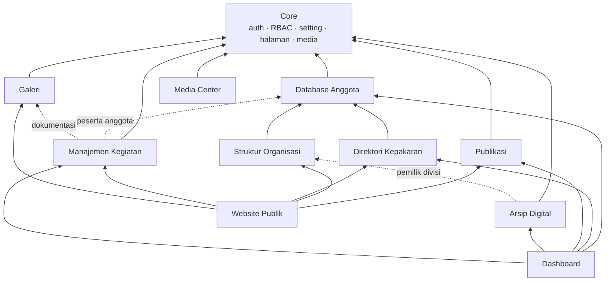

# 7. Daftar Modul & Dependensi

## 7.1 Peta Dependensi Antarmodul

Panah penuh = dependensi wajib; panah putus = dependensi opsional (nullable FK). Urutan build mengikuti arah panah dari bawah: **Core → Membership → (Organization, Expertise) → Publishing/Archive → Events → Dashboard**. Ini yang mendasari urutan roadmap (dok. 06).

## 7.2 Rincian Modul

| Modul | Entitas utama | Bergantung pada | Menyediakan untuk |
|-------|---------------|-----------------|-------------------|
| Core | User, Role/Permission, Page, Setting, Media, ActivityLog | — | Semua modul |
| Database Anggota | Member, District, Profession, riwayat pendidikan/organisasi/publikasi/sertifikasi | Core | Organisasi, Kepakaran, Kegiatan, Dashboard |
| Struktur Organisasi | OrgPeriod, OrgUnit, OrgAssignment | Anggota | Website publik (chart), scoping "divisi" di modul lain |
| Direktori Kepakaran | ExpertiseField, MemberExpertise, ExpertRequest | Anggota | Website publik, Dashboard, (kelak) rekomendasi AI |
| Publikasi | Post, PostCategory, Tag, PostRevision, Newsletter | Core | Website publik, Dashboard |
| Arsip Digital | Document, DocumentVersion, DocumentCategory, DocumentPermission | Core (+Organisasi utk kepemilikan divisi) | Dashboard, (kelak) pencarian semantik |
| Manajemen Kegiatan | Event, EventRegistration, EventReport, EventCertificate | Core (+Anggota, +Galeri) | Website publik, Dashboard |
| Galeri | Album, AlbumItem | Core | Website publik, Kegiatan |
| Media Center | MediaAsset, MediaAssetCategory | Core | Website publik (aset publik) |
| Dashboard | StatisticsService (agregat, tanpa tabel sendiri kecuali page_views) | Hampir semua | Panel admin |
| Website Publik | Livewire Public\* (tanpa entitas sendiri kecuali ContactMessage, Announcement, PageView) | Modul konten | Pengunjung |

## 7.3 Dependensi Paket (Composer)

| Paket | Versi | Kegunaan | Modul |
|-------|-------|----------|-------|
| `laravel/framework` | ^12 | Framework inti | Semua |
| `livewire/livewire` | ^3 | Komponen reaktif | Semua UI |
| `livewire/flux` (+ `flux-pro` bila berlangganan) | ^2 | Design system UI | Semua UI |
| `spatie/laravel-permission` | ^6 | RBAC | Core |
| `spatie/laravel-medialibrary` | ^11 | Manajemen file & conversions | Anggota, Arsip, Galeri, Media Center, Publikasi |
| `spatie/laravel-activitylog` | ^4 | Audit trail | Core, Arsip, Anggota |
| `laravel/scout` | ^10 | Full-text search (database driver → Meilisearch) | Arsip, Publikasi, Pakar |
| `spatie/laravel-sluggable` | ^3 | Slug otomatis | Publikasi, Kegiatan, Galeri |
| `maatwebsite/excel` | ^3 | Impor/ekspor Excel | Anggota, Laporan |
| `simplesoftwareio/simple-qrcode` atau `bacon/qr-code` | ^4 / ^3 | QR registrasi & sertifikat | Kegiatan |
| `barryvdh/laravel-dompdf` | ^3 | Sertifikat & ekspor PDF | Kegiatan, Laporan |
| `smalot/pdfparser` | ^2 | Ekstraksi teks PDF utk full-text search | Arsip |
| `spatie/laravel-backup` | ^9 | Backup DB & storage | Ops |
| `laravel/horizon` | ^5 | Monitoring queue Redis | Ops |
| `predis/predis` atau ext-redis | — | Klien Redis | Ops |
| `laravel/pint`, `pestphp/pest`, `larastan/larastan` | dev | Lint, test, analisis statis | Dev |

Frontend (npm): `tailwindcss`, `alpinejs` (sudah dibawa Livewire), `@tailwindcss/typography`, chart: **Apache ECharts** atau `chart.js` (dashboard), `panzoom` (org chart) — semuanya di-bundle Vite, tanpa CDN.

## 7.4 Kebijakan Dependensi

- Tambah paket hanya bila menggantikan ≥ ratusan baris kode sendiri dan aktif dipelihara.
- Kunci versi mayor di `composer.json`; upgrade mayor = tugas terjadwal dengan test hijau.
- Tidak ada aset dari CDN di produksi — semua via Vite build (portal harus tetap utuh saat koneksi luar terbatas).
