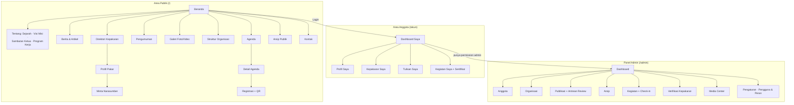

# 8. Desain Antarmuka — Wireframe & Alur Navigasi

Prinsip desain: modern, clean, minimalis, elegan, profesional, cepat, responsif, dark mode. Komponen **Flux UI** dipakai maksimal (navbar, card, badge, table, modal, tabs, dropdown, toast, command palette); komponen custom mengikuti token warna & tipografi Flux.

**Arah visual**: warna primer hijau ICMI (emerald) + aksen emas, netral zinc; tipografi Instrument Sans/Inter; banyak whitespace; sudut membulat lembut; foto kegiatan sebagai elemen visual utama.

---

## 8.1 Peta Navigasi



Aturan navigasi:
- Navbar publik: Beranda, Tentang (dropdown), Informasi (Berita/Artikel/Agenda/Pengumuman), Organisasi (Struktur/Kepakaran), Galeri, Arsip, Kontak + tombol Masuk / avatar.
- Breadcrumb pada semua halaman level ≥ 2. Command palette (⌘K) di panel admin untuk lompat cepat.
- Menu admin difilter otomatis berdasarkan permission — pengguna tidak pernah melihat menu yang tidak bisa diakses.

## 8.2 Wireframe Halaman Kunci

### Beranda (publik)

```
┌──────────────────────────────────────────────────────────┐
│ ◧ Logo ICMI Bengkalis   Beranda Tentang▾ Informasi▾ ...  │
│                                        [🌙] [Masuk]      │
├──────────────────────────────────────────────────────────┤
│  HERO: foto kegiatan + tagline                           │
│  "Cendekiawan Berkarya untuk Negeri"                     │
│  [Direktori Kepakaran]  [Agenda Terdekat]                │
├──────────────────────────────────────────────────────────┤
│  ▣ 250 Anggota  ▣ 48 Pakar  ▣ 12 Kegiatan  ▣ 96 Karya    │  ← statistik ringkas
├──────────────────────────────────────────────────────────┤
│  Berita Terbaru                              [Semua →]   │
│  ┌────────┐ ┌────────┐ ┌────────┐                        │
│  │ card   │ │ card   │ │ card   │   (Flux card + badge)  │
│  └────────┘ └────────┘ └────────┘                        │
├──────────────────────────────────────────────────────────┤
│  Agenda Terdekat (list tanggal)  │  Pengumuman (list)    │
├──────────────────────────────────────────────────────────┤
│  Galeri (grid foto)                          [Semua →]   │
├──────────────────────────────────────────────────────────┤
│  Footer: alamat sekretariat · tautan · medsos · ©        │
└──────────────────────────────────────────────────────────┘
```

### Struktur Organisasi Interaktif

```
┌──────────────────────────────────────────────────────────┐
│ Struktur Organisasi          [Periode: 2025–2030 ▾]      │
│ [🔍 Cari pengurus...]        [⤢ Reset] [+] [−] [⛶ PNG]   │
├──────────────────────────────────────────────────────────┤
│                    ┌───────────┐                         │
│                    │  KETUA    │  ← node: foto+nama+jab. │
│                    └─────┬─────┘                         │
│        ┌───────────┬─────┴─────┬───────────┐             │
│   ┌────▼───┐  ┌────▼───┐  ┌────▼───┐  ┌────▼───┐        │
│   │Sekret. │  │Bendah. │  │Bid. A ▸│  │Bid. B ▾│        │
│   └────────┘  └────────┘  └────────┘  └───┬────┘        │
│                              (collapse)   ├─ node...     │
│   • drag utk pan, scroll/tombol utk zoom                 │
├──────────────────────────────────────────────────────────┤
│ [Klik node] → Flux Modal:                                │
│  ┌ foto ┐  Nama + Gelar          Masa Jabatan 2025–2030  │
│  └──────┘  Jabatan · Bidang Keahlian (badge)             │
│            Riwayat singkat ... [Lihat profil pakar →]    │
└──────────────────────────────────────────────────────────┘
Mobile: pohon menjadi accordion bertingkat (expand/collapse per unit).
```

### Direktori Kepakaran

```
┌──────────────────────────────────────────────────────────┐
│ Direktori Kepakaran ICMI Bengkalis                       │
│ [🔍 Cari nama / topik / bidang...          ] [Cari]      │
│ Filter: [Bidang ▾] [Pendidikan ▾] [Profesi ▾]            │
│         [☑ Bersedia sebagai narasumber]                  │
├───────────────┬──────────────────────────────────────────┤
│ Taksonomi     │  ┌ foto ┐ Dr. Fulan, M.Sc     ★ Pakar    │
│ ▾ Ekonomi     │  └──────┘ Ekonomi Syariah                │
│   · Ek.Syariah│           Dosen — UIN Suska              │
│   · UMKM      │           [badge][badge]  [Profil →]     │
│ ▸ Pendidikan  │  ─────────────────────────────────────   │
│ ▸ Teknologi   │  ┌ foto ┐ Ir. Fulanah, M.T   ★ Pakar     │
│ ▸ Kesehatan   │  └──────┘ ...                            │
├───────────────┴──────────────────────────────────────────┤
│ CTA: "Butuh narasumber?" [Ajukan Permintaan Narasumber]  │
└──────────────────────────────────────────────────────────┘
```

### Panel Admin — Dashboard

```
┌────────────┬─────────────────────────────────────────────┐
│ ◧ ICMI     │ Dashboard                    [⌘K] [🔔] [👤] │
│            ├─────────────────────────────────────────────┤
│ ▸ Dashboard│ ┌───────┐ ┌───────┐ ┌───────┐ ┌───────┐    │
│ ▸ Anggota  │ │Anggota│ │ Baru  │ │Kegiat.│ │Publik.│    │
│ ▸ Kepakaran│ │  250  │ │ +12   │ │  12   │ │  96   │    │
│ ▸ Organisasi│└───────┘ └───────┘ └───────┘ └───────┘    │
│ ▸ Publikasi│ ┌─────────────────────┐ ┌────────────────┐ │
│ ▸ Arsip    │ │ Tren anggota (line) │ │ Sebaran profesi│ │
│ ▸ Kegiatan │ │                     │ │ (donut)        │ │
│ ▸ Galeri   │ └─────────────────────┘ └────────────────┘ │
│ ▸ Media Ctr│ ┌─────────────────────┐ ┌────────────────┐ │
│ ▸ Pengaturan│ │ Sebaran kecamatan  │ │ Antrean review │ │
│            │ │ (bar)               │ │ & verifikasi   │ │
│            │ └─────────────────────┘ └────────────────┘ │
└────────────┴─────────────────────────────────────────────┘
Sidebar = Flux navlist, collapse di mobile menjadi drawer.
```

### Admin — Antrean Review Publikasi

```
┌ Publikasi › Antrean Review ──────────────────────────────┐
│ Tabs: [Menunggu (4)] [Terjadwal] [Ditolak]               │
│ ┌──────────────────────────────────────────────────────┐ │
│ │ Judul            Jenis   Penulis   Diajukan   Aksi   │ │
│ │ Peran Cendekia…  Opini   Fulan     2 jam lalu [Buka] │ │
│ └──────────────────────────────────────────────────────┘ │
│ [Buka] → pratinjau konten + tombol:                      │
│   [✓ Setujui & Terbitkan] [🕐 Jadwalkan] [✗ Tolak+catatan]│
└──────────────────────────────────────────────────────────┘
```

### Check-in Kegiatan (mobile-first, dipakai petugas di lokasi)

```
┌──────────────────────────┐
│ Rakerda 2026 — Check-in  │
│ Hadir: 87 / 120          │
│ ┌──────────────────────┐ │
│ │   [ area kamera QR ] │ │
│ └──────────────────────┘ │
│ atau [🔍 cari nama...]   │
│ ─────────────────────────│
│ ✓ Fulan bin Fulan        │
│   NIA 012 — 09:31 ✓hadir │
└──────────────────────────┘
```

## 8.3 Pola Interaksi Standar

| Pola | Implementasi Flux |
|------|-------------------|
| Konfirmasi aksi destruktif | `flux:modal` konfirmasi, tombol merah, sebut nama objek |
| Umpan balik aksi | `flux:toast` sukses/gagal; tidak memakai alert browser |
| Tabel data admin | `flux:table` + pencarian debounce, filter dropdown, pagination; empty-state dengan CTA |
| Formulir panjang | Dipecah `flux:tabs`/section; autosave draft untuk editor konten |
| Loading | `wire:loading` skeleton/spinner pada setiap aksi > 300 ms |
| Dark mode | Toggle di navbar; token Flux otomatis, gambar diberi latar netral |
| Aksesibilitas | Fokus terlihat, label form eksplisit, kontras AA, alt text wajib di media |
