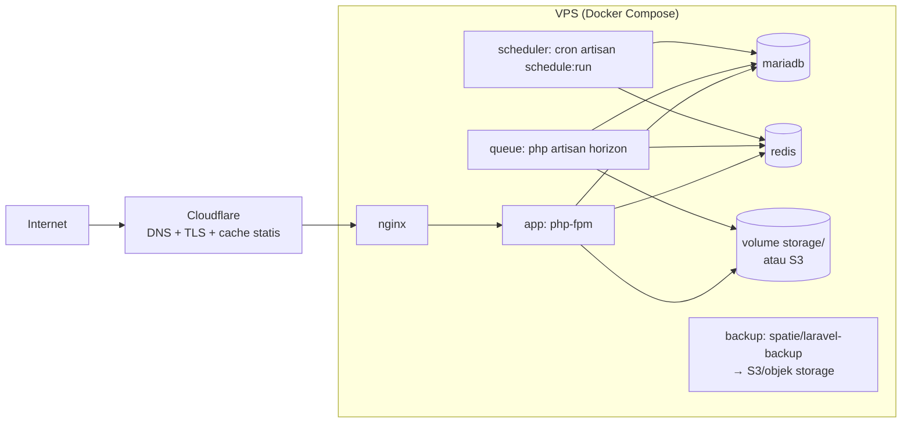

# 9. Strategi Deployment — Docker Compose

Dua lingkungan: **dev** (docker-compose.yml) dan **produksi** (docker-compose.prod.yml). Satu image PHP dipakai app, queue worker, dan scheduler — beda command saja.

---

## 9.1 Topologi Produksi



Spesifikasi awal yang memadai: VPS 2 vCPU / 4 GB RAM / 60 GB SSD. Skala berikutnya: pisahkan DB ke server sendiri, storage ke S3-compatible (MinIO/Wasabi/IDCloudHost).

## 9.2 docker-compose.yml (pengembangan)

```yaml
services:
  app:
    build:
      context: .
      dockerfile: docker/php/Dockerfile
      target: dev
    volumes: [".:/var/www/html"]
    environment:
      PHP_IDE_CONFIG: "serverName=icmi"
    depends_on: [db, redis]

  nginx:
    image: nginx:1.27-alpine
    ports: ["8000:80"]
    volumes:
      - .:/var/www/html
      - ./docker/nginx/default.conf:/etc/nginx/conf.d/default.conf
    depends_on: [app]

  db:
    image: mariadb:11
    environment:
      MARIADB_DATABASE: icmi
      MARIADB_USER: icmi
      MARIADB_PASSWORD: secret
      MARIADB_ROOT_PASSWORD: secret
    ports: ["3306:3306"]
    volumes: [dbdata:/var/lib/mysql]

  redis:
    image: redis:7-alpine
    volumes: [redisdata:/data]

  queue:
    extends: {service: app}
    command: php artisan queue:listen --tries=3 --timeout=120

  mailpit:                       # uji email dev
    image: axllent/mailpit
    ports: ["8025:8025"]

  vite:
    image: node:22-alpine
    working_dir: /var/www/html
    command: sh -c "npm install && npm run dev -- --host"
    volumes: [".:/var/www/html"]
    ports: ["5173:5173"]

volumes:
  dbdata:
  redisdata:
```

## 9.3 Dockerfile multi-stage (docker/php/Dockerfile)

```dockerfile
# ---------- base ----------
FROM php:8.3-fpm-alpine AS base
RUN apk add --no-cache icu-dev libzip-dev libpng-dev libjpeg-turbo-dev \
    libwebp-dev freetype-dev oniguruma-dev \
 && docker-php-ext-configure gd --with-jpeg --with-webp --with-freetype \
 && docker-php-ext-install pdo_mysql intl zip gd bcmath opcache pcntl exif \
 && apk add --no-cache $PHPIZE_DEPS && pecl install redis \
 && docker-php-ext-enable redis && apk del $PHPIZE_DEPS
COPY --from=composer:2 /usr/bin/composer /usr/bin/composer
WORKDIR /var/www/html

# ---------- dev ----------
FROM base AS dev
RUN pecl install xdebug && docker-php-ext-enable xdebug || true

# ---------- assets ----------
FROM node:22-alpine AS assets
WORKDIR /app
COPY package*.json ./
RUN npm ci
COPY . .
RUN npm run build

# ---------- prod ----------
FROM base AS prod
COPY docker/php/php-prod.ini /usr/local/etc/php/conf.d/99-prod.ini
COPY composer.json composer.lock ./
RUN composer install --no-dev --no-scripts --no-autoloader
COPY . .
COPY --from=assets /app/public/build public/build
RUN composer dump-autoload --optimize \
 && chown -R www-data:www-data storage bootstrap/cache
USER www-data
```

## 9.4 docker-compose.prod.yml (perbedaan penting)

```yaml
services:
  app:
    image: ghcr.io/icmibengkalis/portal:${TAG:-latest}   # build di CI, bukan di server
    restart: unless-stopped
    env_file: .env
    volumes: ["storage-data:/var/www/html/storage/app"]

  nginx:
    ports: ["80:80", "443:443"]   # atau di belakang reverse proxy/Cloudflare Tunnel
    volumes: ["storage-public:/var/www/html/storage/app/public:ro"]

  queue:
    image: ghcr.io/icmibengkalis/portal:${TAG:-latest}
    command: php artisan horizon
    restart: unless-stopped

  scheduler:
    image: ghcr.io/icmibengkalis/portal:${TAG:-latest}
    command: sh -c "while true; do php artisan schedule:run --no-interaction; sleep 60; done"
    restart: unless-stopped

  db:
    # TIDAK mem-publish port keluar host
    volumes: [dbdata:/var/lib/mysql]
```

Konfigurasi `.env` produksi yang menentukan:

```
APP_ENV=production APP_DEBUG=false
CACHE_STORE=redis  SESSION_DRIVER=redis  QUEUE_CONNECTION=redis
FILESYSTEM_DISK=local          # ganti "s3" bila pindah objek storage — tanpa ubah kode
MAIL_MAILER=smtp               # SMTP transaksional (mis. Brevo/SES)
```

## 9.5 Alur Rilis (CI/CD)

```
push tag v* ke GitHub
 → CI: pint --test → pest → build image prod → push ghcr.io
 → server: ./deploy.sh
```

`deploy.sh` di server:

```bash
#!/usr/bin/env bash
set -euo pipefail
export TAG=${1:?"pakai: ./deploy.sh v1.2.0"}
docker compose -f docker-compose.prod.yml pull app
docker compose -f docker-compose.prod.yml run --rm app php artisan down --retry=30 || true
docker compose -f docker-compose.prod.yml up -d
docker compose -f docker-compose.prod.yml exec app php artisan migrate --force
docker compose -f docker-compose.prod.yml exec app sh -c \
  "php artisan config:cache && php artisan route:cache && php artisan view:cache && php artisan event:cache"
docker compose -f docker-compose.prod.yml exec app php artisan up
```

Rollback = `./deploy.sh <tag-sebelumnya>` (migration dirancang backward-compatible: tambah kolom dulu, hapus di rilis berikutnya).

## 9.6 Backup & Pemulihan

- `spatie/laravel-backup` terjadwal harian 02:00 WIB: dump DB + `storage/app` → S3-compatible di lokasi berbeda; retensi 30 harian + 12 bulanan.
- Uji restore tiap kuartal (jadwalkan di kalender ops): restore ke container kosong, cek login + hitung baris tabel kunci.
- Monitoring: healthcheck endpoint `/up` (bawaan Laravel 12) dipantau uptime monitor gratis (UptimeRobot); notifikasi backup gagal via email.

## 9.7 Checklist Go-Live

- [ ] `APP_DEBUG=false`, `APP_KEY` terisi, HTTPS aktif (HSTS)
- [ ] Port DB/Redis tidak terekspos publik; firewall hanya 80/443/SSH
- [ ] `RolePermissionSeeder` dijalankan; akun Super Admin dengan 2FA
- [ ] Backup pertama sukses dan teruji restore
- [ ] Rate limit login & form publik aktif; header keamanan Nginx terpasang
- [ ] Sitemap tersubmit ke Google Search Console
- [ ] Halaman error 404/500 kustom
